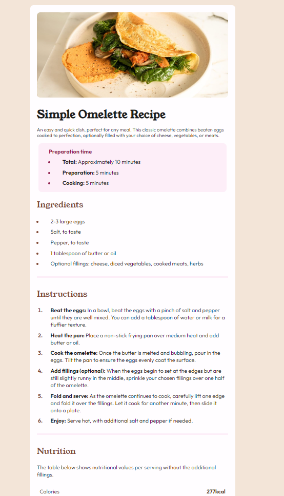

# Frontend Mentor - Recipe page solution

This is a solution to the [Recipe page challenge on Frontend Mentor](https://www.frontendmentor.io/challenges/recipe-page-KiTsR8QQKm). Frontend Mentor challenges help you improve your coding skills by building realistic projects.

## Table of contents

-  [Overview](#overview)
   -  [The challenge](#the-challenge)
   -  [Screenshot](#screenshot)
   -  [Links](#links)
-  [My process](#my-process)
   -  [Built with](#built-with)
   -  [What I learned](#what-i-learned)
   -  [Continued development](#continued-development)
   -  [Useful resources](#useful-resources)
-  [Author](#author)

## Overview

### Screenshot



### Links

-  Solution URL: [recipe-page-main](https://github.com/Rengrouze/recipe-page-main)
-  Live Site URL: [github.io/recipe-page-main](https://rengrouze.github.io/recipe-page-main/)

## My process

### Built with

-  Semantic HTML5 markup
-  CSS custom properties
-  Flexbox

### What I learned

i needed an extra css recap on table and to some peculiar selector like

```css
.nutrition-table td {
   padding: 12px 8px;
   text-align: left;
   vertical-align: middle;
}

.nutrition-table td:nth-child(2) {
   text-align: right;
   font-weight: bold;
}

.nutrition-table tr:not(:last-child) {
   border-bottom: 1px solid #ddd;
}
```

### Continued development

i don't think i'll modify it again, unless i have some bugs AND/OR some semantic issues

### Useful resources

-  [:nth-child](https://developer.mozilla.org/fr/docs/Web/CSS/:nth-child) - Some documentation about this pseudo-class

## Author

-  Frontend Mentor - [@Rengrouze](https://www.frontendmentor.io/profile/Rengrouze)
